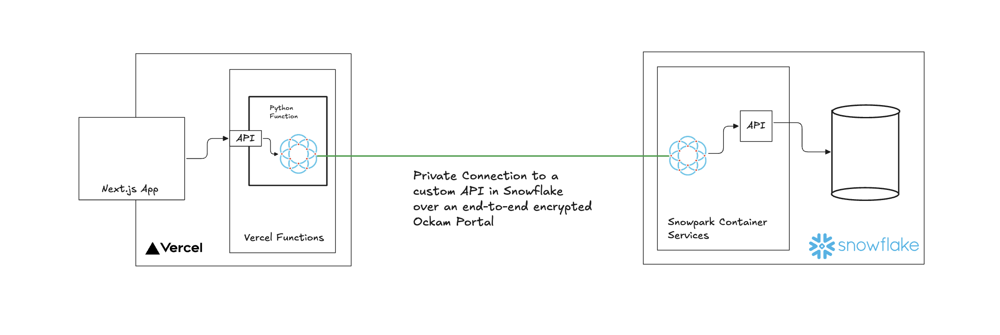

# Call private APIs in Vercel




## Snowflake: Setup a private API in Snowpark Container Services

- [Follow](https://quickstarts.snowflake.com/guide/build_a_private_custom_api_in_python/index.html?index=..%2F..index#0) to setup a private API in Snowpark Container Services

- Create a database, table and insert some data

```sql
-- Use the accountadmin role to create the database, table and insert some data
USE ROLE ACCOUNTADMIN;

-- Grant the DATA_API_ROLE the necessary permissions to use the database and schema
GRANT USAGE ON DATABASE TEST_DATABASE TO ROLE DATA_API_ROLE;
GRANT USAGE ON SCHEMA TEST_DATABASE.PUBLIC TO ROLE DATA_API_ROLE;

-- Create the table
CREATE OR REPLACE TABLE TEST_DATABASE.PUBLIC.PRODUCTS (
    id INTEGER PRIMARY KEY,
    product_name VARCHAR(255),
    price NUMBER(10,2)
);

-- Grant the DATA_API_ROLE the necessary permissions to use the table
GRANT SELECT, INSERT, UPDATE, DELETE ON TABLE TEST_DATABASE.PUBLIC.PRODUCTS TO ROLE DATA_API_ROLE;


-- Insert sample data
INSERT INTO TEST_DATABASE.PUBLIC.PRODUCTS (id, product_name, price)
    VALUES (1, 'Ergonomic Keyboard', 10.99);

INSERT INTO TEST_DATABASE.PUBLIC.PRODUCTS (id, product_name, price)
    VALUES (2, 'Wireless Mouse', 20.99);

INSERT INTO TEST_DATABASE.PUBLIC.PRODUCTS (id, product_name, price)
    VALUES (3, 'LED Monitor 27"', 30.99);
```

- Create two new endpoints `/projects` and `/products/update`. Update `connector.py` to include the new endpoints.

```python
@connector.route('/products')
def get_products():
    sql = '''
        SELECT id, product_name, price
        FROM TEST_DATABASE.public.products
    '''
    try:
        res = conn.cursor(DictCursor).execute(sql)
        return make_response(jsonify(res.fetchall()))
    except:
        abort(500, "Error reading from Snowflake. Check the logs for details.")

@connector.route('/products/update', methods=['POST'])
def update_products():
    sql = '''
        UPDATE TEST_DATABASE.public.products
        SET price = ROUND(UNIFORM(10, 100, RANDOM()), 2)
    '''
    try:
        conn.cursor().execute(sql)
        conn.commit()
        return make_response(jsonify({"message": "Products prices updated successfully"}), 200)
    except:
        conn.rollback()
        abort(500, "Error updating prices in Snowflake. Check the logs for details.")
```

- Rebuild and publish the dataapi image (`/api/private/api/dataapi`) with new endpoints. Drop and create `API.PRIVATE.API` service with new image.


## Vercel: Setup Vercel Serverless functions to access the private API.

### Download latest ockam binary

- Download ockam binary (x86_64-unknown-linux-gnu) from the [Ockam](https://github.com/build-trust/ockam/releases) github repository and place it in the `data/linux-x86_64` directory. Rename the binary to `ockam`.

### Create an enrollment ticket for the Vercel function

```sh
# Generate an inlet ticket for the Vercel function.
ockam project ticket --usage-count 100 --expires-in 10h --attribute snowflake-api-service-inlet > vercel-inlet.ticket
```

### Setup a Vercel project and add the inlet ticket as a secret

- Select `Project Settings`, `Environments`, `Production
- Click `Add Environment Variable`
- Select `Sensitive`
- Add `OCKAM_SNOWFLAKE_INLET_ENROLLMENT_TICKET` as the name
- Add the value of `vercel-inlet.ticket` as the value
- Click `Add`

### Deploy the Vercel function

- Setup vercel cli and select the project
- Deploy the function inside the `api` directory

```sh
vercel --prod
```

### Test the Vercel function

- Use the `/api` endpoint to get the products
- Use the `/api/update` endpoint to update the products


## Setup a Next.js frontend deployed to Vercel to access vercel function

- Optionally you can setup a Next.js frontend to access the vercel function via it's public URLs.
