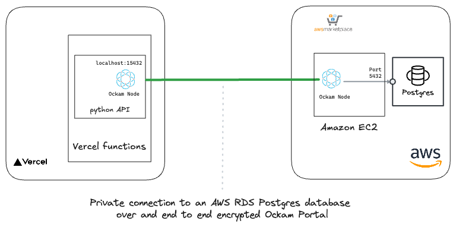

# Access private AWS RDS PostgreSQL Databasefrom Vercel



## AWS

### Setup a private RDS PostgreSQL Database

- [Follow AWS Guide](https://docs.aws.amazon.com/AmazonRDS/latest/AuroraUserGuide/Aurora.AuroraPostgreSQL.html) to setup
  a private RDS PostgreSQL Database

- Create a database, table and insert some data

```sql
CREATE TABLE public.products
(
    id           integer primary key,
    product_name text,
    price        numeric
);

INSERT INTO products (id, product_name, price)
VALUES (1, "Ergonomic Keyboard", 38.30),
       (2, "Wireless Mouse", 93.30),
       (3, "USB Hub", 47.63) '
```

### Setup an Ockam Outlet Node

- [Follow Ockam Guide](https://docs.ockam.io/reference/command/guides/aws-marketplace/ockam-node-for-amazon-rds-postgrese)
  to setup an Ockam Outlet Node in AWS.

## Vercel: Setup Vercel Serverless functions to access the private database.

### Download latest ockam binary

- Download ockam binary `x86_64-unknown-linux-gnu` from the [Ockam](https://github.com/build-trust/ockam/releases)
  github repository and place it in the `data/linux-x86_64` directory. Rename the binary to `ockam`.

### Create an enrollment ticket for the Vercel function

```sh
# Generate an inlet ticket for the Vercel function.
# Values for --usage-count and --expires-in are setup to allow to be used 100 counts for 24 hours.
ockam project ticket --expires-in 24h --usage-count 100 \
  --attribute amazon-rds-postgresql-inlet \
    > "vercel-inlet.ticket"
```

### Setup a Vercel project and add the inlet ticket as a secret

- Select `Project Settings`, `Environments`, `Production
- Click `Add Environment Variable`
- Select `Sensitive`
- Add `OCKAM_RDS_INLET_ENROLLMENT_TICKET` as the name
- Add the value of `vercel-inlet.ticket` as the value
- Click `Add`

- Follow the same steps to add `DB_PASSWORD` as the environment variable

### Deploy the Vercel function

- Setup vercel cli and select the project
- Deploy the function inside the `api` directory

```sh
vercel --prod
```

### Test the Vercel function

- Use the `/api` endpoint to get the products
- Use the `/api/update` endpoint to update the products
